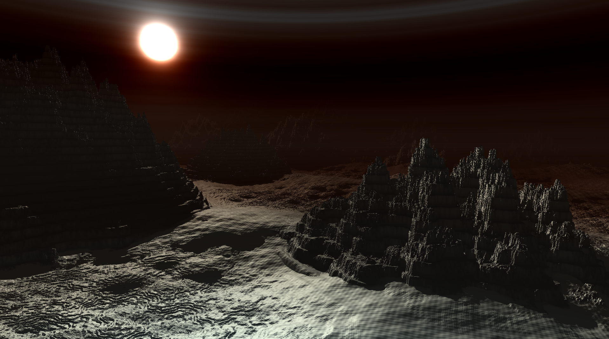
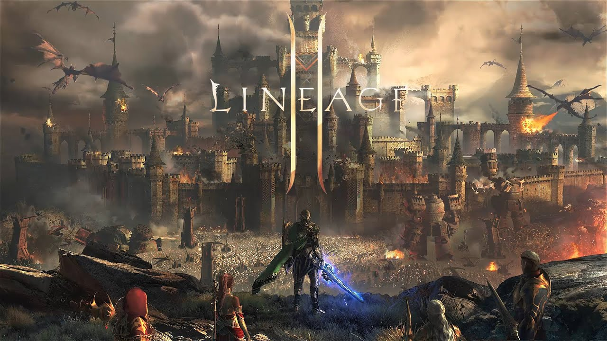
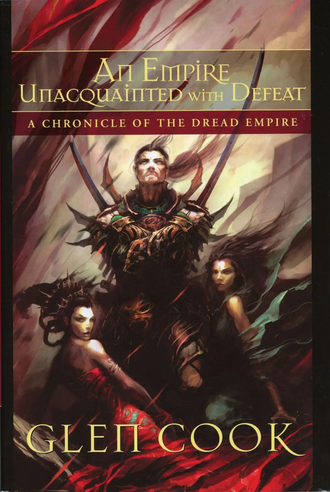
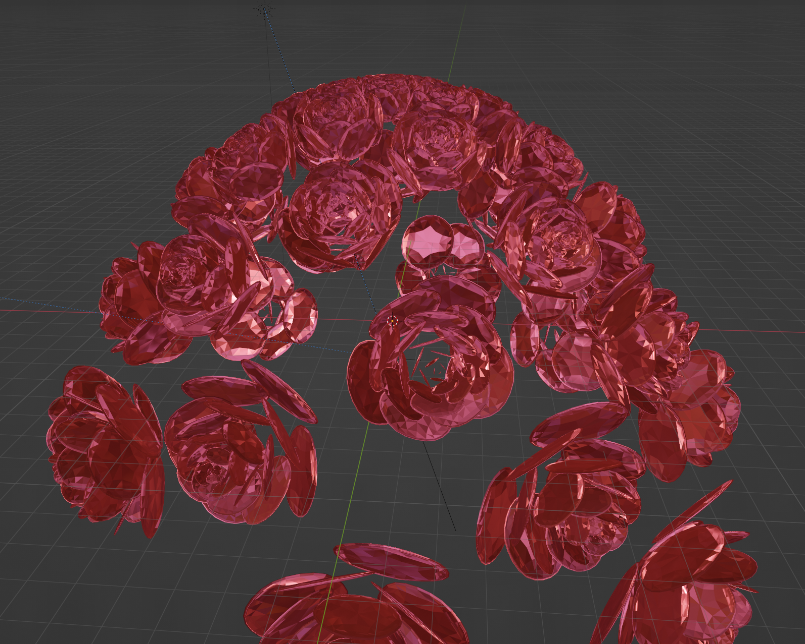

<h1 align="center">Welcome / おはようございます / Witam / Здравствуйте / Velkominn / 안녕하세요 </h1>
<!-- END OF SECTION #0 -->

<table align="center" style="border: 0;padding: 0;margin: 0;border-spacing: 0; border-collapse: collapse;">
    <tr>
        <!-- LEFT -->
        <td align="center" width="27%">            
            

                 

        </td>
        <!-- RIGHT -->
        <td align="center" width="73%">
            

                
                
                 
                <h3 align="center" style="display: flex; justify-content: space-evenly; padding-top: 25px;"><b>You are currently viewing Master Software Engineering  student's public profile.</b></h3> 

            

                <h4 align="center" style="display: flex; justify-content: space-evenly; padding-top: 0px;">「 Computer Games Development, Human-computer Interaction and Space Technologies 」</h4> 

        </td>
    </tr>
</table>
<!-- END OF SECTION #1 -->

<table align="center" style="border: 0;padding: 0;margin: 0;border-spacing: 0; border-collapse: collapse;">
    <!-- TABLE HEADER -->
    <tr align="center" width="100%">
        <h3 align="center"> Here are some of the technologies I had contact with so far! </h3> 
    </tr>
    <tr>
        <!-- LEFT -->
        <td align="center" width="27%">            
            <!-- Languages -->
            

                
                
                
                
                
                
                
                
                 
       
            <!-- Game engines -->
            

                
                
                
                
                
                
                 
          
            <!-- Software -->
            

                
                
                
                 
          
            <!-- OS/Managers -->
            

                
                
                
                
                
                 
            
            <!-- AI & ML -->
            

                
                
                 

            <!-- Collab tools -->
            
 
                
                
                
                
                
                 

            <!-- DevOPS -->
            

                
                 
            
        </td>
        <!-- MIDDLE -->
        <td align="center" width="46%" style="vertical-align:top">
            

                <h6>
                    Credit: ホロライブゲーマーズの白上フブキさん</h6>

            <h3 align="center"><i>“In a time of deceit telling the truth is a revolutionary act.”</i> <h4> ― George Orwell </h4></h3>
             
        </td>
        <!-- RIGHT -->
        <td align="center" width="27%">
            <!-- Web -->
            

                
                
                
                
                
                
                
                
                
                
                 
 
            <!-- Databases -->
            

                
                
                
                
                 

            <!-- IDE/Code editors -->
            

                
                
                
                
                
                 

            <!-- Other "stuff" -->
            
 
                
                
                
                
                
                 

        </td>
    </tr>
</table>
<!-- END OF SECTION #2 -->

<table align="center" style="border: 0;padding: 0;margin: 0;border-spacing: 0; border-collapse: collapse;">
    <tr>
        <!-- LEFT -->
        <td align="center" width="27%">            
            <h3 align="top" style="object-fit: contain;">
                <pre> My <b>TOP</b> languages   (<i>in order</i>)       </pre> </h3>
        </td>
        <!-- MIDDLE -->
        <td align="center" width="46%" style="vertical-align:top">
            <h3 align="center" style="object-fit: contain;"><pre>I've made 🏆<b>1'680</b> contributions across  📜<b>33</b> public repositories and  🔑<b>160</b> private repositories  in the <i>past year<i>.</pre></h3>
        </td>
        <!-- RIGHT -->
        <td align="center" width="27%">
             <h3> </h3>
        </td>
    </tr>
    <!-- FOOTER -->
    <tr align="center" width="100%">
        <td align="center" colspan="3">
        
        
 made with ModernGL & Python 
</td>
    </tr>
</table>
<!-- END OF SECTION #3 -->
     

<table align="center" style="border: 0;padding: 0;margin: 0;border-spacing: 0; border-collapse: collapse;">
    <!-- HEADER -->
    <tr align="center" width="100%">
        <h3 align="center"> Q & A </h3> 
    </tr>
    <tr>
        <h3> 1. How to reach me? 📫 </h3>
        
 I don't use social media. I prefer to stay private and communicate with people I care about directly. In the same time I understand necessity of online availability to strangers for inquiry and jobs. 

        
 That being said here are some ways You can contact me: 

        

            
            
            
             

        
 Sometimes You can also meet me around here: 

        

            
            
            
             

    </tr>
    <tr>
        <h3> 2. What am I currently learning? 🌱 </h3>
        
 Aside from everything that is required as a part of my studies' curriculum I also like learning things in my free time. Currently working on aquiring knowledge in Python adjacent game engines like  and  Ursina,  including GLSL, modernGL, shading and rendering pipelines in general. I'm also slowly getting more comfortable with  

        
  

    </tr>
    <tr>
        <h3> 3. What are some things You can ask me about? 💬 </h3>
        
As someone with very long history with <b>computer games</b> I'm always interested in intricate conversations about them on both conceptual and technical levels. <b>Technologies and tricks of audio-visual effects and animation</b> are also a great topic. Since I'm an "old timer" I deeply care about <b>privacy, personal security, and anonymity</b> everywhere on the Internet and I know a fair bit of how to protect oneself from all kinds of overreach without going paranoid. I'm familiar with <b>technology and emergent innovations</b>, but I'm not a technophile. I love coming up with <b>ideas</b> in all spheres of life and <b>solving complex problems</b>, through smart use of technology with ethics in mind. Even though many of my ideas are currently a pipe dream for one reason or another. I'll gladly help with any of Your projects or at least provide <b>level-headed advice</b> to the best of my ability.

        <h3 align="center"> <b><i>I'm a person of Renaissance and a generalist at heart.</b></i> </h3>
        
  

    </tr>
    <tr>
        <h3> 4. What opportunies am I insterested in? 👨‍💻 </h3>
        
 Anything that has to do with making computer games - designing, testing, gameplay or tools programming, graphics programming, in-game maintaining (multiplayer/MMO balance team), writing or worldbuilding; online media; UX and interaction systems design. I'm also open to the idea of game business analysis and consulting roles. 

        
  

        

            <h5 align="center">  One of my favourite childhood games is Korean MMORPG Lineage 2 made by NCSoft. </h5>

        
  

    </tr>
    <tr>
        <h3> 5. What is my experience? 📄 </h3>
        
 As far as main thing I would like to focus on in my professional career - computer games - I've been playing countless number of games across pretty much all genres my whole life. Among them my favourite one are definitely MMORPGs (Massively multiplayer online role-playing games) that I have been playing since the age of 7. Having this long-term perspective on the "modern gaming" market allows me to see things people not well acquainted with games or new to the hobby lack by the long shot. Often attention to detail can make or break the product or undermine the project in the eyes of the customers. I want to make things right. I won't strain away from questioning and criticizing poorly made decisions and I will provide tangible and reasonable solutions that are also cost effective and fulfill greater context of any given game world. 

        
 When it comes to making games I have completed multiple group projects with my colleagues ranging from online text-based web RPG in PHP, through Wing Commander clone in Blender's node-based game engine, Box2D golf game, several small World of Warcraft interface addons in Lua, macro chains and scripting for Elder Scrolls Online MinionMM-supported framework, ACT GUI overlay custom port for FFXIV, openCV mining bot for Albion Online, to Action Diablo/Path of Exile-style RPG in Unity, which was also a part of my Bachelor's Project. On top of that I have completed or actively am working on small solo projects like clones of classic arcade games from '80s and '90s, things like Street Fighter, Zelda, Mario, Stardew Valley, Pokemon, Castle Defence, physics-based puzzle games etc.

        
When it comes to my lived professional practice I'd like to refer You to my  profile or my Resume for further details. 

        
  

    </tr>
    <tr>
        <h3> 6. What are my hobbies? 💭 </h3>
        

        <ul style="list-style-type:none;text-align:justify;">
            <li><b>Games </b> 
                <ul><i>computer games</i> to be exact. I'm firm advocate of disambiguation of terms between platforms like PC, consoles and mobile of which the latter two I would classify as <i>"Video Games"</i> as their complexity has become synonymous with graphical fidelity in opposition to <i>"Computer Games"</i> which excel in gameplay and richness of systems department. I also do not like the term <i>"gamer"</i> as it creates unpleasant stereotype of mindless consumer of media created for mass-appeal with no long-term substance or life-long lessons players can take with them through good memories. I prefer terms like <i>"player"</i>, <i>"games enjoyer"</i>, <i>"a connoisseur of interactive arts"</i> (this one is a joke), someone usual, normal, with self control and restraint, adventurer with stoic mind; a nobody, that has to work through obstacles to prove their worth in the story where main hero is the fantastic/horrific/amazing world itself. You are more than welcome to disagree with my position. Heck! Let's talk about it. </ul>
                <ul align="center">  - Ok... but name some games that you like... - </ul>
                <ul align="center">  <i>Lineage 2, Guild Wars 2, Aion: Tower of Eternity, The Elder Scrolls IV: Oblivion, Battlefield 4, Ryse: Son of Rome, Gothic series, Diggles: The Myth of Fenris </i></ul></li>
             
            <li><b>Modifying and customizing software and hardware </b>
                <ul>is my passion. I love modding games, creating my own versions of interfaces, taking advantage of addon repositories to make games feel more "at home" more my style, unlocking hidden content and adding new elements that make them better. I also like to dip my fingers in writing custom shaders and tinkering with visual composition and presentation thanks to amazing tools like ReShade. If game can be changed, improved, fixed through community driven initiative I have and will continue to do so. Every game that has a modding scene has its longevity at least doubled. Not to mention that having contact with so many talented individuals willing to put many many hours into non-profit project like this is really inspiring. I learn so much from them. On top of that I had my fair share of opportunities in playing around with hardware, fixing, and troubleshooting physical devices, designing, and building PC-class desktop workstations and setting up electronic devices like Arduino. </ul></li>
             
            <li><b>Reading and books </b>
                <ul>are great! I have been reading fantasy and science-fiction books almost religiously even since I was a little kid. I'm fascinated by stories, mysterious unknown worlds, character development and their adventures. Worldbuilding of these adventures inspire me, feed my rich imagination, and teach me things I would never expect I needed in life. I'm enamoured with writing of people like Glen Cooks, Trudi Canavan, Brent Weeks, George Orwell, Fyodor Dostoevsky, Yamamoto Tsunetomo, Aldous Huxley or Kentarō Miura. I love Berserk manga; I love Warhammer 40'000; it's lore books from Black Library catalogue and stories around horrific fate of future mankind and the Emperor are pure kino. I prefer my books in paper, physical objects that I can touch, smell, and enjoy in my personal library every day. If I hunt for a title to add to my collection, I will spare no expense or effort in getting it. </ul>
                

                    <h5 align="center">  One of my favourite book series is Glen Cook's <i>A Chronicle of the Dread Empire</i>.</h5>
</li>
             
            <li><b>Cooking </b>
                <ul>is easy and fun. As a child I always liked helping in the kitchen. Both male and female members of my family are excellent cooks - no wonder I took after them. I was raised with principles of being independent so ability to feed myself and others is like a second nature to me. Thus, as long as you can bring me ingredients, I can cook anything for you! I like sampling new dishes, testing new techniques and equipment. I don't shy away from bizarre culinary experiments. Among all I probably enjoy baking cakes the most. </ul></li>
             
            <li><b>Gardening </b>
                <ul>is unexpected for sure. I maintain both house plants efficiently and small garden with edible plants like carrots, potatoes, tomatoes, strawberries, apples, plums, or cherries. Spending at least some time in the nature is great. On top of that having contact with physical labour that brings fruits I can enjoy throughout the year is quite satisfying. Thanks to the richness of my garden, I can eat healthier and sweat away making preserves for the pantry which I can enjoy off season too. I also get some neighbours in form of numerous critters like lizards, snakes, ravens, crows, starlings, and occasional family of stray cats. </ul></li>
             
            <li><b>Art, photography and design </b>
                <ul>even though I'm not an excellent artist by any means. I like drawing and creating 3D models, rigs, animations and set pieces in software like Blender or Unity. I also have good sense of composition and visual cohesion. I have strong imagination and can be very creative at times while at the same time I can plan my projects step-by-step with ease. For personal fashion I prefer elegant, but modest outfits with saturated natural colors in style of modernized '30s and business casual. I enjoy playing with appearance design for characters in games. I have an old SLR camera I made thousand of pictures with. Photography allows me to share my perspective with others by immortalizing common situations in a unique, unexpected, and natural way. I appreciate art of others and love learning from their expertise. I'm fascinated by both 2D and 3D animations, visual effects and lightworks. By the nature of their medium I consider both games and anime to be art. </ul>
                

                    <h5 align="center">  My poor attempt at making procedurally generated bouquet of flowers in Blender through build-in Python scripting.</h5>
</li>
             
            <li><b>Niche music </b>
                <ul>and finding new artists is nice. I go out of my way to seek unknown smaller artists that show their passion and craft through their works, to avoid modern corporate slop. There is something special in hearing original works that only maybe 300 people in the whole world heard about. Also supporting these artists is way more impactful as just a single individual. I like whole range of genres from '80s' electronic music, through 2000-and-10s rock, to ethnic music and Vocaloid. I love discovering new stuff and listening to unusual often experimental things depending on the day, mood, and humour. Here are some creators I picked for this section: </ul>
                <table border="0" align="center">
                    <tr>
                        <td align="right"> artcore </td> 
                        <td> Taishi, Nhato, Onoken, Sakuzyo, Scythe of Luna </td></tr>
                    <tr>
                        <td align="right"> maidcore </td> 
                        <td> Yakui the Maid (whole "[x] the maid" club) </td></tr>
                    <tr>
                        <td align="right"> metal </td> 
                        <td> Ayunda of Absinthe Records Philippines, In Flames,  Hammerfall, Beast in Black, Soulfly, Amon Amarth </td></tr>
                    <tr>
                        <td align="right"> electronic </td>
                        <td> Voicians, Blue Stahli, Zardonic, Essenger </td></tr>
                    <tr>
                        <td align="right"> syncwave/retrowave </td>
                        <td> The Midnight, The Muscle </td></tr>
                    <tr>
                        <td align="right"> citypop from the '80s </td>
                        <td> Yukiko Okada, Akina Nakamori </td></tr>
                    <tr>
                        <td align="right"> eurobeat </td>
                        <td> Max Coveri, Dave Rodgers, Niko, ACE</td></tr>
                    <tr>
                        <td align="right"> vocaloid </td> 
                        <td> Utsu-p, Mitchie M., Reol,  Inabakumori, DECO*27, PinocchioP </td></tr>
                    <tr>
                        <td align="right"> Touhou Project </td>
                        <td> Akatsuki Records, Demetori, Alstroemeria Records,  UNDEAD CORPORATION, SOUND HOLIC </td></tr>
                    <tr>
                        <td align="right"> j-rock </td>
                        <td> ELFENSJóN, Hiroyuki Sawano, Milli </td></tr>
                    <tr>
                        <td align="right"> jazz/hip-hop/vaporwave </td>
                        <td> Haircuts for Men, Macroblank, Modest by Default,  OSCOB, GODSPEED, slowerpace 音楽, Nujabes </td> </tr> 
                    <tr>
                        <td align="right"> ethnic </td>
                        <td> Warduna, Heilung, Danheim, Myrkur, Eihwar </td></tr>
                    <tr>
                        <td align="right"> operas </td>
                        <td> Clive Nolan </td></tr>
                    <tr>
                        <td align="right"> mix genre </td>
                        <td> Vanguard Sound Studios, Yostar, RWBY collection, Lappy </td></tr> </table></li>
             
            <li style="text-indent: 30px;text-align:justify;"><b>Foreign cultures and languages </b>
                <ul>as well as folklore, mythology, and ancient history. Experiencing how people from different parts of the world and time think/thought is fascinating and to understand them better you need tools that will ease your journey into their minds. One of such tools is their language and their culture. Getting to know both opens many doors, whether it's learning new languages to communicate with natives or to surprise international friends; or going in-depth into customs and etiquette of people from distant and not-so-distant lands; or pondering on how people thought in the past and how their world view has shaped are just few of the keys for these doors. Learning new languages is easy for me.. I have my favourites cultures to deepen my knowledge about like: Japanese, Nordic-Viking, Slavic, Korean, Chinese, Roman, Protoeuropean, Innuit and Finnish. I can get along with international acquaintances quite well. My native tongue is  <b>Polish</b> the language of Poland, I know  <b>English</b> in professional capacity, I can speak beginner  <b>Japanese</b> and  <b>Russian</b>, I can say some things in  <b>Latin</b>,  <b>Korean</b>,  <b>Finnish</b>,  <b>Icelandic</b> and <b>general  Arabic</b>. When it comes to folklore I love digging deep into different creatures and monsters and moral lessons they carry with them. </ul></li>
             
            <li style="text-indent: 30px;text-align:justify;"><b>Space exploration and practical realization of it </b>
                <ul>is of great interest to me. Looking through the lens of sci-fiction space fascinated me from young age. It's endless expanse and limitless possibilities - the future of Mankind - gave me fuel for endless hours spent researching, reading about it and watching documentaries. Having limited subset of knowledge, I started developing my own theories about nature of things like black holes, dark matter and dark energy, reasons for existence of Boötes Void or Barnard 68 sector, conceptual energy sources and system scale constructions as well as, largely thanks to sci-fi, logic-based ideas what other species might look like or what kinds of technology they might possess. It's probably all a child's imagination making up things, but it’s certainly fun and engaging to think about things like that. All this indirectly led me to my Master's project which revolves around new generation of space suit helmets with inspired by games customizable HUD (<i>Heads-up Display</i>, graphical user interface) that will allow astronauts to personalize their workspace while participating in EVAs (<i>Extravehicular Activities</i>) aka Space Walks. I hope it would be possible to turn my project into reality one day. </ul>
                

                    <h5 align="center">  Example of EVA. Photograph taken by astronaut Chris Cassidy during the mission ISS-36 in 2013.</h5>
</li>
             
            <li style="text-indent: 30px;text-align:justify;"><b>Science in general </b>
                <ul><i>as in scientific method, not the dogma. </i>Encountering concepts previously unknown is quite exciting and allow oneself to get lost in discovery and wonder. Constant flow of research papers, articles and findings lead to updates in the way we perceive the world and ourselves and is a fine game between chasing trends and deciding what parts of new discoveries are useful to us in our daily lives. Despite all of that, nothing is set in stone, things change as we acquire more knowledge and complete research. Thus, we need to take whole process with a grain of salt and fall into pit falls of dogmatic thinking. <i>"Question everything and everyone. Especially people You agree with."</i> If their propositions are legitimate, they will have receipts to show for it. Don't let ideology cloud your judgement, whatever it is. Science is a process, not a state. That's about it of me preaching. I like reading scientific papers, reports on new discoveries and watching documentaries. I enjoy figuring out and understanding novel ideas, by collecting obscure unfiltered and uncensored knowledge on variety of topics. </ul></li>
             
            <li style="text-indent: 30px;text-align:justify;"><b>Fitness and self improvement </b>
                <ul>including martial arts and military. Life of a software engineer is, by the nature of work we do, very stationary. To counterbalance this and to stay in excellent health we need to move as much as we can. With physical health and exercise come mental fortitude and resistance to the banes of modern life - stress, anxiety, existential doom. I am avid long-distance runner and perform calisthenics routine every day. I also do some weightlifting and meditation. I'm a big fan of self discipline and self control. I study martial arts like Kenpo and Systema, although not as often as I would like. I'm interested in old Kendo and historical European martial arts which revolve around masterful use of white weaponry. As a European I hold HEMA dear as it is a part of my heritage. I grew up in the region rich in medieval castles and stories about knights, honour, and love. I also appreciate ancient and military thought and systems like Spartan Civil Traditions, Shinto, or Zen Buddhism, and I try to adhere to their principles, when possible, often for fun and to test those techniques on myself. There is something special about pushing one’s limits and seeing slow yet steady progress in becoming a better person. I always strive to eat healthy and avoid highly processed foods, fast-food products, and empty calories. I don’t drink alcohol, smoke tobacco or partake in drugs. </ul></li>
             
            <li style="text-indent: 30px;text-align:justify;"><b>Animation and CGI </b>
                <ul>mediums fascinate me. They are modern vehicles of presenting and sharing stories and a technological marvel of multidisciplinary soup where every ingredient matters, and result depends on the smallest details needed to accurately fulfill the vision of their creators. I love exploring intricacies of cinematography, especially in building moods; inspiring writing full of mature themes, skilful weaving-in real life knowledge and philosophical thought into storytelling, proficiency in scattering puzzles for viewers to have them assemble everything by themselves; building elaborate layers of metaphors and allegories that make viewers think. I admire mastery in the craft of vsfx and mixing styles as well as ability in transitioning mediums from written/drawn to moving pictures. I grew up watching both western and eastern animated shows, 2D, 3D and mixed with CGI. I use Japanese anime to hone my language skills and I'm in awe of world class expertise of Japanese voice actors. In recent times China and Korea joined the medium and many of their shows are already a great success. Although at the last position western animation has not given up yet and they commercially excel in stylized 3D movies. I could list hundreds of 2D animes I watched over the years that I consider good here, but I will limit myself to amazing eastern 3D ones that are lesser known and for more refined taste. <i>Gantz O, Captain Harlock, Kingsglaive - the Final Fantasy XV Movie, RWBY 1-6, Ninja Batman, Kengan Ashura, Ajin, Dragon's Dogma</i>. 
</ul></li>
             
            <li style="text-indent: 30px;text-align:justify;"><b>Vtubers and online content creation </b>
                <ul>... </ul></li>
              

        
 I support all and any kinds of gatekeeping necessary to hold integrity of any given hobby. Everyone is welcome to join, but only most devout and experienced of the members should have a say on what changes are implemented. Ignorance of so called "tourists" should be called out, counteracted accordingly and subversive individuals removed. 

        
  

    </tr>
    <tr>
        <h3> 7. What kind of person am I? ⚡ </h3>
        
 Well... it is difficult to be objective of oneself, but I will try. 

        
  

    </tr>
    <tr>
        <h3> 8. Why did I bother with so much detail here on GitHub? ☄️ </h3>
        
 Projects are not just computer code, spreadsheets, features and issue tracking. It's also people. And people like other people that are more like them. Having more in-depth information allows me to broaden the horizon and expand the limits of what kinds of people would like to associate with me by having many topics of mutual interest that will enhance our professional or more casual cooperation. Having fun together will make us a better team. 

        
  

    </tr>
</table>