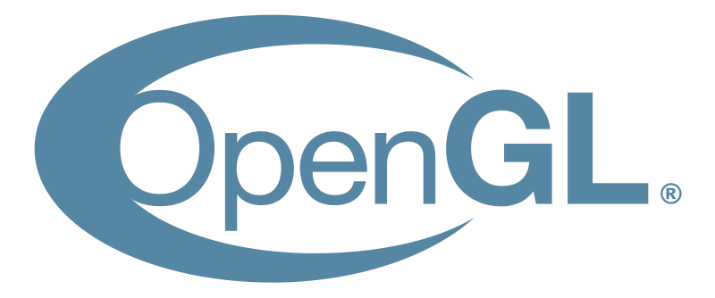

<h1 align="center">Welcome / おはようございます / Witam / Здравствуйте / Velkominn / 안녕하세요 </h1>
<!-- END OF SECTION #0 -->

<table align="center" style="border: 0;padding: 0;margin: 0;border-spacing: 0; border-collapse: collapse;">
    <tr>
        <!-- LEFT -->
        <td align="center" width="27%">            
            

                 

        </td>
        <!-- RIGHT -->
        <td align="center" width="73%">
            

                
                
                 
                <h3 align="center" style="display: flex; justify-content: space-evenly; padding-top: 25px;"><b>You are currently viewing Master Software Engineering  student's public profile.</b></h3> 

            

                <h4 align="center" style="display: flex; justify-content: space-evenly; padding-top: 0px;">「 Computer Games Development, Human-computer Interaction and Space Technologies 」</h4> 

        </td>
    </tr>
</table>
<!-- END OF SECTION #1 -->

<table align="center" style="border: 0;padding: 0;margin: 0;border-spacing: 0; border-collapse: collapse;">
    <!-- TABLE HEADER -->
    <tr align="center" width="100%">
        <h3 align="center"> Here are some of the technologies I had contact with so far! </h3> 
    </tr>
    <tr>
        <!-- LEFT -->
        <td align="center" width="27%">            
            <!-- Languages -->
            

                
                
                
                
                
                
                
                
                 
       
            <!-- Game engines -->
            

                
                
                
                
                
                
                 
          
            <!-- Software -->
            

                
                
                
                 
          
            <!-- OS/Managers -->
            

                
                
                
                
                
                 
            
            <!-- AI & ML -->
            

                
                
                 

            <!-- Collab tools -->
            
 
                
                
                
                
                
                 

            <!-- DevOPS -->
            

                
                 
            
        </td>
        <!-- MIDDLE -->
        <td align="center" width="46%" style="vertical-align:top">
            

                <h6>
                    Credit: ホロライブゲーマーズの白上フブキさん</h6>

            <h3 align="center"><i>“In a time of deceit telling the truth is a revolutionary act.”</i> <h4> ― George Orwell </h4></h3>
             
        </td>
        <!-- RIGHT -->
        <td align="center" width="27%">
            <!-- Web -->
            

                
                
                
                
                
                
                
                
                
                
                 
 
            <!-- Databases -->
            

                
                
                
                
                 

            <!-- IDE/Code editors -->
            

                
                
                
                
                
                 

            <!-- Other "stuff" -->
            
 
                
                
                
                
                
                 

        </td>
    </tr>
</table>
<!-- END OF SECTION #2 -->

<table align="center" style="border: 0;padding: 0;margin: 0;border-spacing: 0; border-collapse: collapse;">
    <tr>
        <!-- LEFT -->
        <td align="center" width="27%">            
            <h3 align="top" style="object-fit: contain;">
                <pre> My <b>TOP</b> languages   (<i>in order</i>)       </pre> </h3>
        </td>
        <!-- MIDDLE -->
        <td align="center" width="46%" style="vertical-align:top">
            <h3 align="center" style="object-fit: contain;"><pre>I've made 🏆<b>1'680</b> contributions across  📜<b>33</b> public repositories and  🔑<b>160</b> private repositories  in the <i>past year<i>.</pre></h3>
        </td>
        <!-- RIGHT -->
        <td align="center" width="27%">
             <h3> </h3>
        </td>
    </tr>
    <!-- FOOTER -->
    <tr align="center" width="100%">
        <td align="center" colspan="3">
        
        
 made with ModernGL & Python 
</td>
    </tr>
</table>
<!-- END OF SECTION #3 -->
     

<table align="center" style="border: 0;padding: 0;margin: 0;border-spacing: 0; border-collapse: collapse;">
    <!-- HEADER -->
    <tr align="center" width="100%">
        <h3 align="center"> Q & A </h3> 
    </tr>
    <tr>
        <h3> 1. How to reach me? 📫 </h3>
        
 I don't use social media. I prefer to stay private and communicate with people I care about directly. In the same time I understand necessity of online availability to strangers for inquiry and jobs. 

        
 That being said here are some ways You can contact me: 

        

            
            
            
             

        
 Sometimes You can also meet me around here: 

        

            
            
             

    </tr>
    <tr>
        <h3> 2. What am I currently learning? 🌱 </h3>
        
 Aside from everything that is required as a part of my studies' curriculum I also like learning things in my free time. Currently working on aquiring knowledge in Python adjacent game engines like  and  Ursina,  including GLSL, modernGL, shading and rendering pipelines in general. I'm also slowly getting more comfortable with  

        
  

    </tr>
    <tr>
        <h3> 3. What are some things You can ask me about? 💬 </h3>
        
As someone with very long history with <b>computer games</b> I'm always interested in intricate conversations about them on both conceptual and technical levels. <b>Technologies and tricks of audio-visual effects and animation</b> are also a great topic. Since I'm an "old timer" I deeply care about <b>privacy, personal security and annonimity</b> everywhere on the Internet and I know a fair bit of how to protect oneself from all kinds of overreach without going paranoid. I'm familiar with <b>technology and emergent innovations</b>, but I'm not a technophile. I love coming up with <b>ideas</b> in all spheres of life and <b>solving complex problems</b>, through smart use of technology with ethics in mind. Even though many of my ideas are currently a pipe dream for one reason or another. I'll gladly help with any of Your projects or at least provide <b>level-headed advice</b> to the best of my ability.

        <h3 align="center"> <b><i>I'm a person of Renaissance and a generalist at heart.</b></i> </h3>
        
  

    </tr>
    <tr>
        <h3> 4. What opportunies am I insterested in? 👨‍💻 </h3>
        
 Anything that has to do with making computer games - designing, testing, gameplay or tools programming, graphics programming, in-game maintaining (fe. multiplayer/MMO balance team), writing or worldbuilding; online media; UX and interaction systems design. 

        
  

        

             
            
 One of my favourite childhood games is Korean MMORPG Lineage 2 made by NCSoft. 

        
  

    </tr>
    <tr>
        <h3> 5. What is my experience? 📄 </h3>
        
 As far as main thing I would like to focus on in my professional career - making computer games - I've been playing countless amount of games across pretty much all genres my whole life. Among them my favourite one are definetly MMORPGs (Massively multiplayer online role-playing games) that I have been playing since the age of 7. Having this long term perspective on the "modern gaming" market allows me to see things people not well acquainted with games or new to the hobby lack by the long shot. Often attention to detail can make or break the product or undermine the project in the eyes of the customers. I want to make things right. I won't strain away from questioning and critisizing poorly made decisions and I will provide tangible and reasonable solutions that are also cost effective and fulfill greater context of any given game world. 

        
When it comes to my lived professional practice I'd like to refer You to my  profile or my Resume for further details. 

        
  

    </tr>
    <tr>
        <h3> 6. What are my hobbies? 💭 </h3>
        

        <ul style="list-style-type:none;">
            <li>First</li>
            <li>Second</li>
            <li>Third</li> </ul> 

        
  

    </tr>
    <tr>
        <h3> 7. What kind of person am I? ⚡ </h3>
        
 Well... it is difficult to be objective of oneself, but I will try. 

        
  

    </tr>
</table>